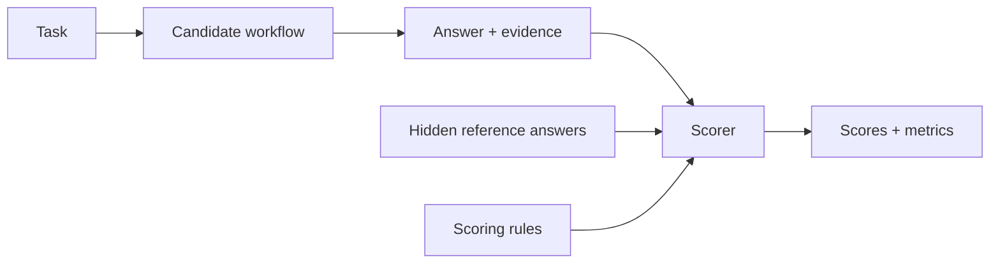

# Tracecat labs

Run security-agent evaluations in Tracecat, modify the Candidate, and measure the results.

## Quick start

> [!IMPORTANT]
> Use these labs only for training, experimentation, and evaluation: they require two
> Tracecat Enterprise (EE) entitlements—`service_accounts` for API access and
> `agent_addons` for agent folders and tags.

Run commands from this repository's root.

| Prerequisite | Required |
|---|---|
| Tools | Terraform 1.11+, Go, Python 3, Docker Compose, `just`, `jq`, `curl`, `openssl`, Git LFS |
| Model access | A model provider and its credential, configured during setup |

1. **Set up Tracecat.** Follow the prompts to select a workspace and configure model access.

   ```bash
   just setup
   ```

2. **Deploy all seven labs.** This also starts Lab 001's Splunk target.

   ```bash
   just deploy
   ```

3. **Run Lab 001.** Copy the returned `evaluation_run_id`.

   ```bash
   just run 001
   ```

4. **Wait for the evaluation.** Replace `<evaluation-run-id>` below with that ID. Repeat until the execution completes successfully.

   ```bash
   just status 001 RUN_ID=<evaluation-run-id>
   ```

5. **Score the evaluation.** Copy the returned `judge_run_execution_id`.

   ```bash
   just judge 001 RUN_ID=<evaluation-run-id>
   ```

6. **Wait for scoring.** Use the Judge's execution ID here. Repeat until the execution completes successfully.

   ```bash
   just status 001 RUN_ID=<judge-run-execution-id>
   ```

7. **Get results.** Use the original Evaluation Run ID.

   ```bash
   just grade 001 RUN_ID=<evaluation-run-id>
   ```

   Results: `001/results/<evaluation-run-id>/`.

   | File | Contains |
   |---|---|
   | `scores.csv` | Per-criterion scores |
   | `metrics.csv` | Aggregate metrics |
   | `summary.json` | Run summary |

`run` and `judge` start asynchronously. `grade` does not start or wait for scoring.

## Labs

| Lab | Task | Scoring |
|---|---|---|
| [001](001/) | Investigate a LiteLLM / Trivy supply chain attack, starting from a single AWS alert | True-positive gate + 16 weighted findings |
| [002](002/) | Triage 20 Splunk Boss of the SOC alerts: separate false alarms from threats and connect them to the intrusion | Evidence gate + determination and relevance |
| [003](003/) | Turn vulnerability reports into firewall rules for seven Vulhub CVEs and an n8n file-read vulnerability | Deployability gate + malicious/benign tests |
| [004](004/) | Uncover an attack chain hidden in 155,350 Windows events | Narrative-step and tactic coverage |
| [005](005/) | Solve 589 investigation questions by digging through logs from eight security incidents | Answer success + solution-step reward |
| [006](006/) | Turn threat intelligence into tested detection rules for 50 Linux, Kubernetes, and cloud scenarios | Five trajectory and outcome checkpoints |
| [007](007/) | Put your agent’s security knowledge to the test with 50 multiple-choice challenges | Exact-choice accuracy |

For another lab, follow its README for data preparation and target startup.

## Modify the Candidate

1. Open the lab folder in Tracecat.
2. Edit `NNN Candidate — Modify`, then **commit** the workflow.
3. Adjust the `Lab NNN Candidate` preset under **Agents** as needed.
4. Repeat quickstart steps 3–7 with your lab number to evaluate the changes.

| In Tracecat | Purpose | Edit for experiments? |
|---|---|---|
| `NNN Candidate — Modify` | Context, skills, budgets, agent orchestration | Yes |
| `Lab NNN Candidate` preset | Agent prompt and settings | Yes |
| `Agent tools` | Access lab data and services | No |
| `Scoring` / `Utilities` | Grade answers and maintain the environment | No |

To run through the UI: start `NNN Run evaluation — Run first`, wait, then start
`NNN Judge — Run second` with the Evaluation Run ID.

**Keep your edits:** `just apply` asks before restoring committed Candidate
workflow edits to the repository baseline; declining stops the apply.
Noninteractive restoration requires `CONFIRM_CANDIDATE_RESET=true`.
`AUTO_APPROVE` does not bypass this safeguard.

## Agent access

| Lab | Candidate access |
|---|---|
| 001 | Splunk through MCP |
| 002 | DuckDB through `core.duckdb.execute_sql` |
| 003, 007 | Case content only |
| 004 | Threat logs through `query_threat_logs` |
| 005 | Incident databases through `query_incident_sql` |
| 006 | CTI search, event queries, and Sigma validation/execution |

**Access limitation:** Candidate/tool separation is convention-based, not enforced
by a per-workflow sandbox. Candidates must not read evaluation tables or hidden
answers. See [tool inventory and boundaries](docs/reference.md#tools-and-access-boundaries).

## How evaluation works



| Term | Meaning |
|---|---|
| Case | Task and visible work: analysis, evidence, final answer |
| Trial | One Candidate attempt on a Case Template |
| Evaluation Run | A group of trials |
| Oracle | Hidden reference answers |
| Rubric | Versioned scoring rules |

- Scorers use deterministic checks, an LLM Judge, or both.
- Binary criteria award zero or full credit; numeric criteria allow partial credit.
- A failed hard gate sets the trial's composite score to zero.
- Metrics aggregate results across trials. Private model reasoning is not graded.

## Common operations

Replace `NNN` with the lab number. Keep the empty arguments shown below: recipe arguments are positional.

| Task | Command / location |
|---|---|
| Resume unfinished trials | `just run NNN "" RUN_ID=<evaluation-run-id>` |
| Check a resumed execution | `just status NNN RUN_ID=<resume-execution-id>` |
| Retry incomplete scoring | `just judge NNN RUN_ID=<evaluation-run-id>` |
| Run with eight concurrent trials | `just run NNN "" "" BATCH_SIZE=8` |
| Find reports | `NNN/results/<evaluation-run-id>/` |
| Preview workspace changes | `just plan` |

- [Operations reference](docs/reference.md): setup, reset, tools, checkpoints, and proposed features.
- [Contributing](CONTRIBUTING.md): add a lab, [define scoring](CONTRIBUTING.md#scoring-profile-contract), or inspect the [results contract](CONTRIBUTING.md#results-contract).
